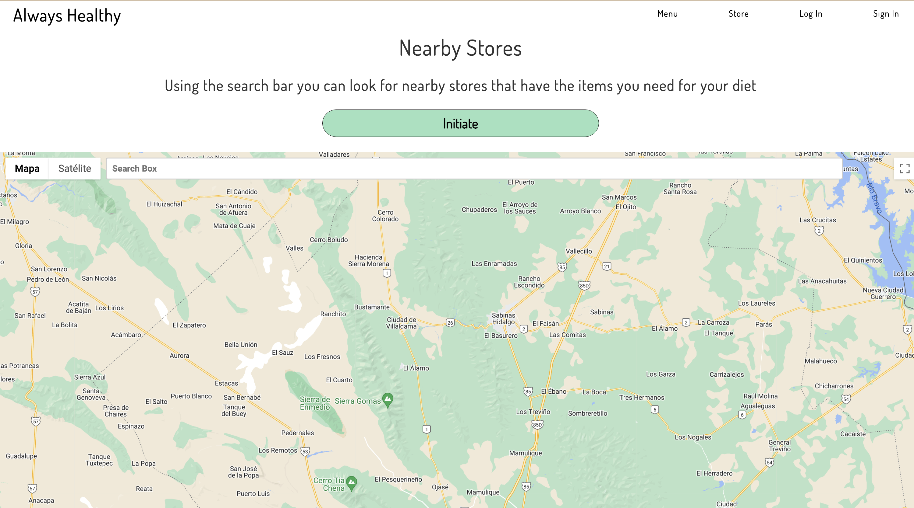
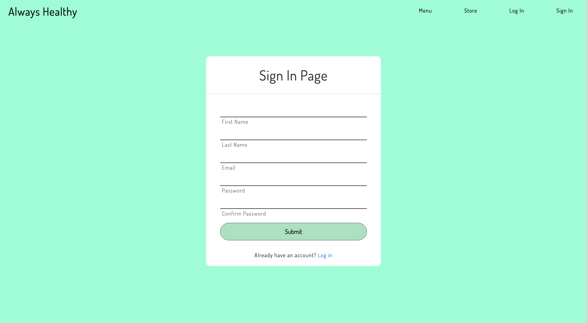
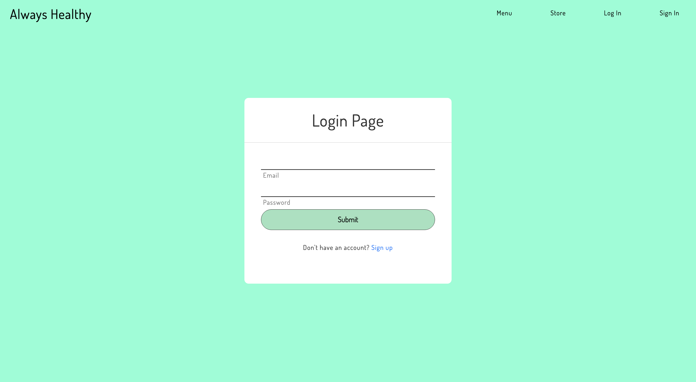
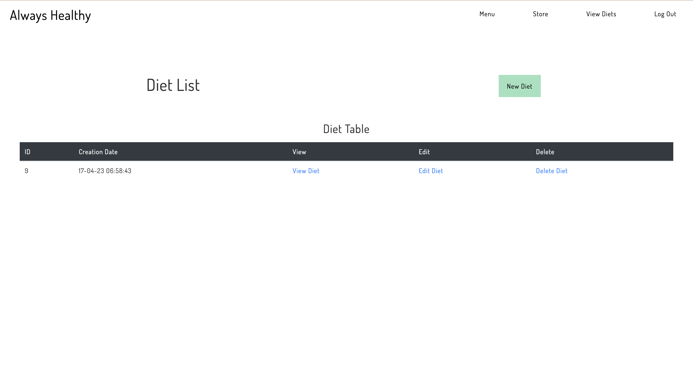
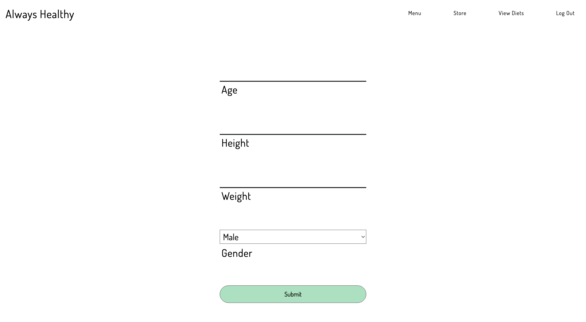
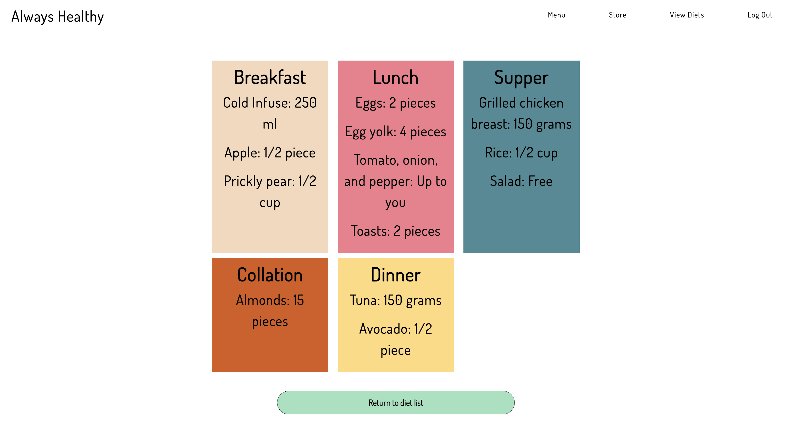
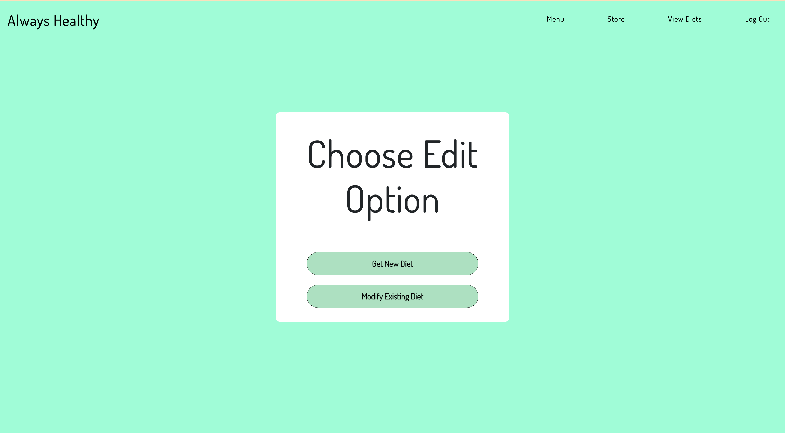
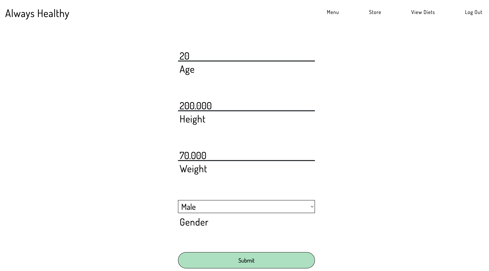
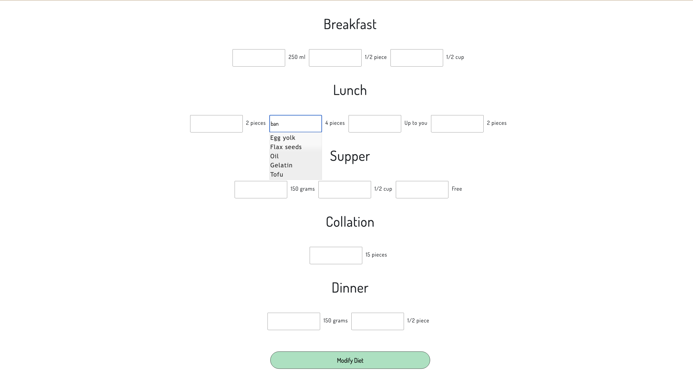
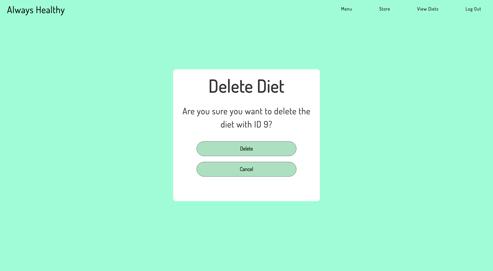

<a name="readme-top"></a>
<div align="center">
    
    <h3 align="center">Diet Site</h3>
    <p align="center">
      Web application with the purpose of encouraging healthy eating and a better lifestyle. Can create diets based on the Mifflin-St.Jeor(m) equation, offer alternative foods, delete diets, and search nearby locations where one may buy the ingredients needed for the diets. Uses PHP and Javascript mainly, alongisde HTML5 and CSS3 for the structure of the site, JQuery and Ajax to send and display information, and MySQL to store data such as the information of the diets and user info. The database is hosted locally using the MAMP development environment.
    </p>
</div>


<details>
  <summary>Table of Contents</summary>
  <ol>
    <li>
      <a href="#about-the-project">About The Project</a>
      <ul>
        <li><a href="#tech-stack">Technologies Used</a></li>
      </ul>
    </li>
    <li>
      <a href="#getting-started">Getting Started</a>
      <ul>
        <li><a href="#prerequisites">Prerequisites</a></li>
        <li><a href="#installation">Installation</a></li>
      </ul>
    </li>
    <li><a href="#demo">Demo</a></li>
    <li><a href="#future-updates">Future Updates</a></li>
    <li><a href="#acknowledgments">Acknowledgments</a></li>
  </ol>
</details>


## About The Project

One of the biggest challenges that people face when dealing with healthy eating is commitment. People can be lazy and won't make the effort to eat healthy
unless the steps to do it are simplified. This is the goal of this web application, give users quick access to diets through different ways: getting one through email, answering questions to calculate one, or modifying an existing diet with recommended alternatives.
<br/>
<br/>
This diet site allows you to create an account, which is stored in a SQL database that gives to said account with email and password. After creating an account, a diet can be generated by entering age, weight, height and gender. You can view, edit and delete your diet, and can create as many diets as needed. Using the Google Maps API, you can look up locations near you to buy the items required for your diet. If you are not interesting in personalizing your diet, you can just enter your email on the main page to receive a general diet.

<p align="right">(<a href="#readme-top">back to top</a>)</p>

## Tech Stack
This section lists the languages and frameworks used to realize this project:
* [![PHP][php]][php-url]
* [![Javascript][jscript]][js-url]
* [![Jquery][jquery]][jquery-url]
* [![MySQL][mysql]][mysql-url]
* [![HTML5][html5]][html5-url]
* [![CSS3][css3]][css3-url]


## Getting Started
This section will address how to set up this project locally. This will involve installing different libraries on your machine and a server environment to run the web application
### Prerequisites

Open the terminal and paste this line to install Composer, run the second line to test if it has installed correctly.
  * Composer
  ```sh
  php -r "copy('https://getcomposer.org/installer','composer-setup.php');"  
  php composer.phar
  ```
  
 Download 
 on the official site: https://www.mamp.info/en/downloads/
 
 Download the PHPMailer library from this repository: https://github.com/PHPMailer/PHPMailer and add it to your project

### Installation
This section will explain what keys or information are needed to make the APIS and libraries work

1. Clone the repo
   ```sh
   git clone https://github.com/GusavoCoutino/DietSite.git
   ```

2. Create a .env file in your directory

3. Get a Google Maps API key from the <a href="https://cloud.google.com/?utm_source=google&utm_medium=cpc&utm_campaign=latam-MX-all-es-dr-BKWS-all-all-trial-e-dr-1605194-LUAC0010195&utm_content=text-ad-none-any-DEV_c-CRE_512379899402-ADGP_Hybrid%20%7C%20BKWS%20-%20EXA%20%7C%20Txt%20~%20GCP_General-KWID_43700062784667416-kwd-301173107424&utm_term=KW_google%20cloud-ST_Google%20Cloud&gclid=CjwKCAjw__ihBhADEiwAXEazJocqLLlrn9_YgR1MCVlQpUv6wk2B_N19n7P-dwhxJwhT7gHHkNGMKxoCllQQAvD_BwE&gclsrc=aw.ds&hl=es-419">official site</a>

4. Paste your API key in the .env file 
```sh
  MAPS_API_KEY = "Your API key"
  ```
5. For the PHPMailer, you will need a new email from where to send the emails. Create a new email and place it in the .env file  
  ```sh
  MAIL_USERNAME = "Your email"
  ```
  
 6. With your new email, create an app password (Go to Manage your Google Account, Security, Signing in to Google, and App Passwords). Place your app password in the .env file.

  ```sh
  EMAIL_PASSWORD = "Your app password"
  ```
  
  7. For the PHPMailer library, use "smtp.gmail.com" as the host. Copy the following line into the .env file.
   ```sh
  HOST = "smtp.gmail.com"
  ```
  
  8. Use 465 as your email port
   ```sh
  EMAIL_PORT = 465
  ```
 <p align="right">(<a href="#readme-top">back to top</a>)</p>

## Demo
This section will be a walkthrough of the web application, the expected inputs and reactions that occur.

<h3>Main Page</h3>

<p>This is the main page of the web application. This is mostly an informative page of the application, although you can input an email in the text field that appears at the top. If the email is incorrect, a Javascript alert will popup saying that the email was not valid. If the email was valid, a PDF file containing a diet will be sent to the email that was input. The navbar at the top can be used to navigate the application.</p>

<h3>Map</h3>

<p>This page has a map that allows the user to look up any location, using the Google Maps API. Initially, the page will be blank with only the navbar, the paragraph, and the button. After pressing a button, a map will be generated, marking your current location. A search box will then load, which will allow the user to look up any place on the map, ideally locations that can help them buy the items necessary for their diets. This map, as mentioned earlier, was generated using the Google Maps API, alongside the Autocomplete widget.</p>

<h3>Sign In</h3>

<p>This is the sign in page for the application. To submit the information and create an account, all fields must be filled out, otherwise if the submit button is pressed without all the fields, an alert will appear saying that not all the fields have information. Aditionally, if the passwords in both password fields are not the same, another alert will pop up saying that the passwords are equal. If all the information is added properly, pressing the button will make a call to the database to add the email, first name, last name, and the password. The user will then be redirected to the main page and will appear as logged in (this will be noted by the different navbar options, which now include create diet and log out).</p>

<h3>Log In</h3>

<p>This is the log in page for the application. To log in the user must already have created an account in the sign in page. If the email and password fields are not filled out when the submit button is pressed, an alert will pop up saying that not all the fields are complete. If all the fields are complete and if either the password or email do not exist an error message will appear saying that the account does not exist. If the email and password do exist, the application will react the same way it would do for a successful sign in in the Sign In page, the user is redirected to the main page as logged in.</p>

<h3>Diet List</h3>

<p>In this page, the user will view the diets it has created. If no diets have been created, the table will appear empty. If there are diets, they will appear as seen in the screenshot, with the options to edit, delete, and view the diet. To create a diet, the create diet button must be pressed, which will move the user to a new page</p>

<h3>Create Diet</h3>

<p>In this page, the user will be able to fill out information so that a diet is generated automatically. The process is the same as log in and sign in, not filling out all the fields will result in an alert, and the information will only be processed if everything is complete. Once the information is submitted, a function that calculates the amount of calories using the St Mifflin Jeor will be called, and the information regarding the diet will be added to the database.</p>

<h3>View Diet</h3>

<p>This page only displays a stylized version of a diet. It includes the foods that should be eating in breakfast, lunch, supper, collation, and dinner. Once the user is done looking, they can click the return button to be redirected to the Diet List page</p>

<h3>Choose Edit</h3>

<p>After clicking the Edit Diet link, the user is sent to this page, where they can choose whether to do the same form in Create Diet to get a new one, or press the modify diet to change the diet they got for other food alternatives.</p>

<h3>Get New Diet</h3>

<p>This page is the one the user is sent when they choose to get a new diet by doing the previous form done in the Create Diet page. Both pages work exactly the same, except that in the Get New Diet page, the information previously answered by the user is loaded into the text fields</p>

<h3>Modify Diet</h3>

<p>This page is the one the user is sent when they choose to modify their existing diet. The page has text fields for each food option, and each food option has alternative food choices that show up when typing into a text field. This is done using the Autocomplete widget from JQuery. The diet is only modified if all the fields are completed.</p>

<h3>Delete Diet</h3>

<p>When the user presses the Delete Diet link in the Diet List page, this is the page they are sent to. The only thing that can be done is deleting a diet. This only happens when the button is pressed, and if the user has not modified the parameter that is on the page link.</p>

<p align="right">(<a href="#readme-top">back to top</a>)</p>

## Future Updates
- [ ] Update Store (Google Maps API map) page to save markers from the user in the database
- [ ] Add authentication to log in and sign in (Google Cloud, Firebase, Auth0)
- [ ] Add more diets that can be generated

<p align="right">(<a href="#readme-top">back to top</a>)</p>

## Acknowledgments

Use this space to list resources you find helpful and would like to give credit to. I've included a few of my favorites to kick things off!

* [Owl Carousel Plugin](https://owlcarousel2.github.io/OwlCarousel2/)
* [Easy Pie Chart Plug In](https://rendro.github.io/easy-pie-chart/)
* [Jquery UI for Autocomplete and Ajax](https://jqueryui.com/)
* [Composer for the PHPMailer library](https://getcomposer.org/)
* [PHPMailer library](https://github.com/PHPMailer/PHPMailer)
* [DEV Community for the programming languages badges used in this ReadMe](https://dev.to/envoy_/150-badges-for-github-pnk)

<p align="right">(<a href="#readme-top">back to top</a>)</p>


<!-- MARKDOWN LINKS & IMAGES -->
<!-- https://www.markdownguide.org/basic-syntax/#reference-style-links -->
[php]: https://img.shields.io/badge/PHP-777BB4?style=for-the-badge&logo=php&logoColor=white
[php-url]: https://www.php.net/
[jscript]: https://img.shields.io/badge/JavaScript-F7DF1E?style=for-the-badge&logo=javascript&logoColor=black
[js-url]: https://developer.mozilla.org/en-US/docs/Web/JavaScript
[jquery]: https://img.shields.io/badge/jQuery-0769AD?style=for-the-badge&logo=jquery&logoColor=white
[jquery-url]: https://jquery.com/
[mysql]: https://img.shields.io/badge/MySQL-00000F?style=for-the-badge&logo=mysql&logoColor=white
[mysql-url]: https://www.mysql.com/
[html5]: https://img.shields.io/badge/HTML5-E34F26?style=for-the-badge&logo=html5&logoColor=white
[html5-url]: https://html.spec.whatwg.org/multipage/
[css3]: https://img.shields.io/badge/CSS-239120?&style=for-the-badge&logo=css3&logoColor=white
[css3-url]: https://www.w3.org/Style/CSS/Overview.en.html